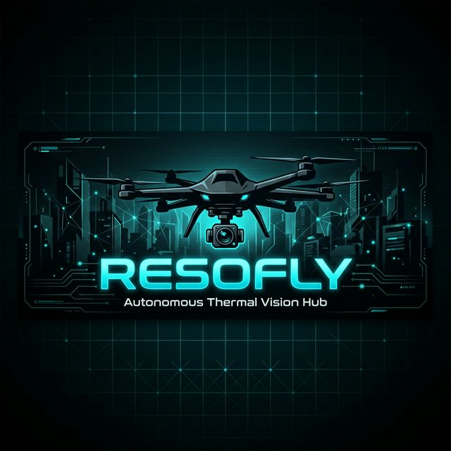

<p align="center">
  
</p>

<h1 align="center">RESOFLY</h1>

<p align="center">
  <b>🛸 Autonomous Thermal Vision Hub — Real-Time Aerial Surveillance on Raspberry Pi</b>
</p>

<p align="center">
  
  
  
  
  
  
</p>

<p align="center">
  <a href="#-features">Features</a> •
  <a href="#-tech-stack">Tech Stack</a> •
  <a href="#%EF%B8%8F-architecture">Architecture</a> •
  <a href="#-installation">Installation</a> •
  <a href="#-usage">Usage</a> •
  <a href="#-future-improvements">Roadmap</a>
</p>

---

## 🧠 What is RESOFLY?

**RESOFLY** is a self-hosted, plug-and-play thermal surveillance system that turns a **Raspberry Pi** into a fully autonomous monitoring station. It streams live thermal video from a **FLIR Lepton** sensor, tracks GPS coordinates in real-time, detects nearby Bluetooth devices, and delivers everything through a secure, beautifully designed **cyberpunk-themed web dashboard** — accessible from anywhere in the world via a Cloudflare tunnel.

> **Power on the Pi → Get an email with a public URL → Monitor everything from your browser.**  
> Zero manual configuration needed.

---

## 🎯 Problem It Solves

Traditional thermal surveillance setups require expensive hardware, complex networking, and manual supervision. RESOFLY eliminates all of that:

| Problem | RESOFLY Solution |
|---|---|
| **Expensive thermal systems** | Runs on a $35 Raspberry Pi |
| **Complex network setup** | Auto-tunnels to the internet via Cloudflare |
| **Manual monitoring** | Autonomous boot → tunnel → email notification |
| **Poor UI for embedded systems** | Premium glassmorphism dashboard with 3D drone login |
| **No remote access** | Secure JWT-authenticated access from any browser |

---

## 👥 Who Is This For?

- 🔬 **Researchers & Academics** — Thermal imaging field studies
- 🛡️ **Security Teams** — Perimeter surveillance and intrusion detection
- 🧑‍💻 **IoT/Embedded Developers** — Reference architecture for Pi-based sensor hubs
- 🌿 **Wildlife Conservationists** — Night-time heat-signature monitoring
- 🚒 **Emergency Responders** — Rapid-deploy thermal scanning units

---

## ✨ Features

### 🔥 Thermal Imaging
- Live MJPEG thermal video streaming (RGB / Thermal / Overlay modes)
- FLIR Lepton 3.5 integration with radiometric temperature data
- Real-time thermal heat map visualization with color mapping
- Human detection via centroid tracking algorithm

### 🛰️ GPS Tracking
- Real-time GPS coordinate display (latitude, longitude, altitude, speed)
- NMEA 0183 protocol parsing with `pynmea2`
- Interactive map integration with Leaflet
- One-click coordinate copy

### 📡 Bluetooth Scanner
- Nearby Bluetooth device discovery and listing
- Signal strength (RSSI) monitoring
- Device count tracking with signal visualization

### 🔐 Security & Access
- JWT-based authentication with bcrypt password hashing
- Secure Cloudflare Tunnel — no port forwarding needed
- Automatic email notification with public access URL on boot
- Login-protected dashboard with session management

### 🎨 Premium UI/UX
- **Cyberpunk / Glassmorphism** design aesthetic
- Interactive 3D drone SVG on login screen (follows your cursor!)
- Dark/light theme toggle
- Fully responsive (desktop, tablet, mobile)
- Real-time alert system with ACK/dismiss functionality

### ⚡ Plug & Play Autonomy
- `systemd` services auto-start everything on boot
- Zero-config Cloudflare tunnel for instant remote access
- Gmail SMTP notification bot emails the access link automatically

---

## 🛠️ Tech Stack

### Frontend
| Technology | Purpose |
|---|---|
| **React 18** | Component-based UI framework |
| **TypeScript** | Type-safe development |
| **Vite** | Lightning-fast build tooling |
| **Tailwind CSS** | Utility-first styling |
| **Radix UI** | Accessible component primitives |
| **Leaflet** | Interactive GPS map rendering |
| **Recharts** | Real-time data visualization |
| **React Router** | SPA routing |

### Backend
| Technology | Purpose |
|---|---|
| **Python 3.9+** | Core runtime |
| **FastAPI** | High-performance async API server |
| **SQLite + aiosqlite** | Lightweight async database |
| **OpenCV** | Thermal image processing & color mapping |
| **PySerial + pynmea2** | GPS NMEA data parsing |
| **PyJWT + bcrypt** | Authentication & security |
| **Uvicorn** | ASGI server |

### Infrastructure
| Technology | Purpose |
|---|---|
| **Raspberry Pi 4** | Edge compute platform |
| **FLIR Lepton 3.5** | Thermal camera (I2C/SPI) |
| **U-blox GPS Module** | Location tracking (Serial/USB) |
| **Cloudflare Tunnel** | Secure remote access |
| **Docker** | Containerized deployment |
| **systemd** | Service lifecycle management |

---

## 🏗️ Architecture

```
┌─────────────────────────────────────────────────────────────┐
│                     RASPBERRY PI 4                          │
│                                                             │
│  ┌──────────────┐    ┌──────────────────────────────────┐   │
│  │  FLIR Lepton │───▶│        PYTHON BACKEND            │   │
│  │  (I2C/SPI)   │    │    ┌────────────────────┐        │   │
│  └──────────────┘    │    │   FastAPI Server    │        │   │
│                      │    │   (server.py)       │        │   │
│  ┌──────────────┐    │    ├────────────────────┤        │   │
│  │  GPS Module  │───▶│    │  Thermal Pipeline  │        │   │
│  │  (USB/UART)  │    │    │  Camera / GPS /    │        │   │
│  └──────────────┘    │    │  Bluetooth Modules │        │   │
│                      │    └────────┬───────────┘        │   │
│  ┌──────────────┐    │             │ REST + WebSocket    │   │
│  │  Bluetooth   │───▶│             ▼                    │   │
│  │  (HCI)       │    │    ┌────────────────────┐        │   │
│  └──────────────┘    │    │  SQLite Database   │        │   │
│                      │    └────────────────────┘        │   │
│                      └──────────────┬───────────────────┘   │
│                                     │                       │
│  ┌──────────────────────────────────▼───────────────────┐   │
│  │              REACT FRONTEND (Vite)                   │   │
│  │  Dashboard │ Video │ GPS Map │ Alerts │ BT Scanner   │   │
│  └──────────────────────────────────────────────────────┘   │
│                           │                                 │
│  ┌────────────────────────▼─────────────────────────────┐   │
│  │            CLOUDFLARE TUNNEL (cloudflared)            │   │
│  └──────────────────────────┬───────────────────────────┘   │
└─────────────────────────────┼───────────────────────────────┘
                              │
                    ┌─────────▼─────────┐
                    │   PUBLIC INTERNET  │
                    │  (Your Browser)   │
                    └───────────────────┘
```

---

## 📂 Project Structure

```
RESOFLY/
├── backend/
│   ├── server.py              # FastAPI main server (41KB)
│   ├── camera.py              # Simulated camera (dev mode)
│   ├── thermal_pipeline.py    # Thermal processing engine
│   ├── thermal_detection.py   # Human detection algorithms
│   ├── thermal_engine.py      # Thermal data engine
│   ├── waveshare_thermal.py   # Waveshare camera HAT support
│   ├── centroid_tracker.py    # Object centroid tracking
│   ├── gps_real.py            # GPS NMEA parser
│   ├── bluetooth_scanner.py   # BT device discovery
│   ├── monitor_tunnel.py      # Email notification bot
│   ├── setup_boot.sh          # systemd service installer
│   ├── start_backend.sh       # Backend startup script
│   ├── scan_helper.sh         # BT scan helper
│   ├── verify_sensors.py      # Hardware verification
│   ├── clear_alerts.py        # Alert database cleanup
│   └── requirements.txt       # Python dependencies
├── src/
│   ├── pages/
│   │   ├── Login.tsx           # 3D cyberpunk login screen
│   │   └── Index.tsx           # Dashboard entry point
│   ├── components/
│   │   ├── ThermalDashboard.tsx    # Main control center
│   │   ├── VideoStreamBox.tsx      # MJPEG stream viewer
│   │   ├── GPSCoordinateBox.tsx    # GPS display + map
│   │   ├── AlertBox.tsx            # Alert notifications
│   │   ├── ThermalHeatMap.tsx      # Heat map chart
│   │   ├── BluetoothScannerBox.tsx # BT device list
│   │   ├── IncidentMap.tsx         # Incident mapping
│   │   ├── SignalTracker.tsx       # Signal visualization
│   │   └── ThemeToggle.tsx         # Dark/light toggle
│   └── contexts/                   # Auth context
├── Dockerfile                 # Multi-stage Docker build
├── vite.config.ts             # Vite + API proxy config
├── tailwind.config.ts         # Tailwind theme config
├── package.json               # Frontend dependencies
└── RESOFLY_DOCUMENTATION.md   # System documentation
```

---

## 🚀 Installation

### Prerequisites
- **Node.js** ≥ 18 & **npm**
- **Python** ≥ 3.9
- **Git**
- *(For production)* Raspberry Pi 4 with FLIR Lepton + GPS module

### 1. Clone the Repository

```bash
git clone https://github.com/bijoymg2023/RESOFLY.git
cd RESOFLY
```

### 2. Setup Backend

```bash
# Create virtual environment
python3 -m venv .venv
source .venv/bin/activate    # macOS/Linux
# .venv\Scripts\activate     # Windows

# Install dependencies
pip install -r backend/requirements.txt
```

### 3. Setup Frontend

```bash
npm install
```

### 4. Configure Environment

Create `backend/.env`:
```env
SECRET_KEY=your-secret-key-here
ALGORITHM=HS256
ACCESS_TOKEN_EXPIRE=30
DATABASE_URL=sqlite:///./thermo_vision.db
```

### 5. Run Development Server

```bash
# Terminal 1 — Start Backend
source .venv/bin/activate
uvicorn backend.server:app --reload --host 0.0.0.0 --port 8000

# Terminal 2 — Start Frontend
npm run dev
```

### 🐳 Docker (Alternative)

```bash
docker build -t resofly .
docker run -p 8000:8000 resofly
```

---

## 💻 Usage

### Access the Dashboard

1. Open your browser and navigate to:
   - **Frontend**: `http://localhost:5173` *(dev mode)*
   - **API Docs**: `http://localhost:8000/docs`

2. Login with default credentials:
   ```
   Username: admin
   Password: resofly123
   ```

3. The dashboard provides:
   - **Live thermal video feed** — Switch between RGB, Thermal, and Overlay modes
   - **GPS tracking panel** — Real-time coordinates with an interactive Leaflet map
   - **Thermal heat map** — Live temperature data visualization
   - **Alert system** — Auto-generated alerts for thermal anomalies
   - **Bluetooth scanner** — Nearby device detection and signal tracking

### Raspberry Pi Deployment (Production)

```bash
# Install auto-start services
cd backend
sudo bash setup_boot.sh

# Services will auto-start on every boot:
# ✅ resofly.service         → Python backend
# ✅ resofly-tunnel.service  → Cloudflare tunnel
# ✅ resofly-notify.service  → Email notification bot
```

After setup, simply **power on the Pi** — it will:
1. Start all services automatically
2. Create a Cloudflare tunnel
3. Email you the public access URL

### API Endpoints

| Method | Endpoint | Description |
|---|---|---|
| `POST` | `/api/token` | JWT authentication |
| `GET` | `/api/gps` | Current GPS coordinates |
| `GET` | `/api/system/status` | System health & CPU temp |
| `GET` | `/api/alerts` | Active thermal alerts |
| `GET` | `/api/stream/thermal` | MJPEG thermal video stream |
| `GET` | `/api/bluetooth/devices` | Discovered BT devices |

---

## 🖼️ Screenshots

> 🚧 *Screenshots coming soon — contributions welcome!*
>
> To capture your own screenshots, run the dev server and visit the login page and dashboard.
> The login page features an interactive 3D drone SVG that responds to cursor movement.

---

## 🔮 Future Improvements

- [ ] **AI-Powered Detection** — Integrate YOLOv8 for person/animal/vehicle detection on thermal feeds
- [ ] **Multi-Camera Support** — Dashboard to manage and switch between multiple thermal cameras
- [ ] **Historical Playback** — Record and replay thermal footage with GPS trail overlay
- [ ] **Mobile App** — React Native companion app with push notifications
- [ ] **Edge ML Inference** — On-device TensorFlow Lite for real-time classification
- [ ] **LoRa Mesh Networking** — Multi-Pi sensor grid with LoRa communication
- [ ] **3D Terrain Mapping** — Fuse thermal + GPS data into 3D heatmap terrain models
- [ ] **Battery Monitoring** — UPS HAT integration with battery level alerts
- [ ] **Voice Alerts** — Text-to-speech announcements for critical thermal events
- [ ] **Drone Integration** — MAVLink protocol for autonomous drone flight control

---

## 🤝 Contributing

Contributions are welcome! Feel free to open issues or submit pull requests.

1. Fork the repo
2. Create your feature branch (`git checkout -b feature/amazing-feature`)
3. Commit your changes (`git commit -m 'feat: add amazing feature'`)
4. Push to the branch (`git push origin feature/amazing-feature`)
5. Open a Pull Request

---

## 📄 License

This project is open source and available under the [MIT License](LICENSE).

---

<p align="center">
  <b>Built with 🔥 on Raspberry Pi</b><br/>
  <sub>RESOFLY — See the unseen.</sub>
</p>
