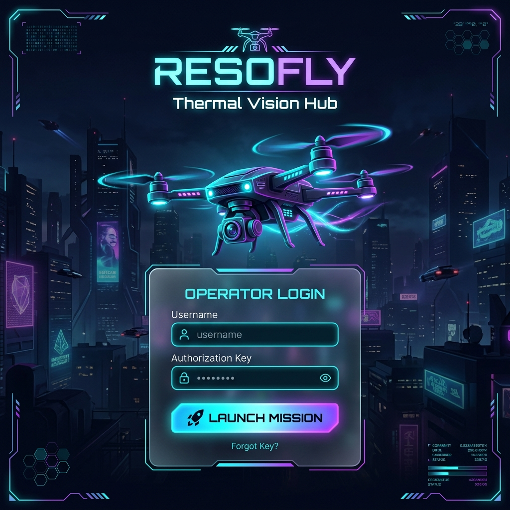
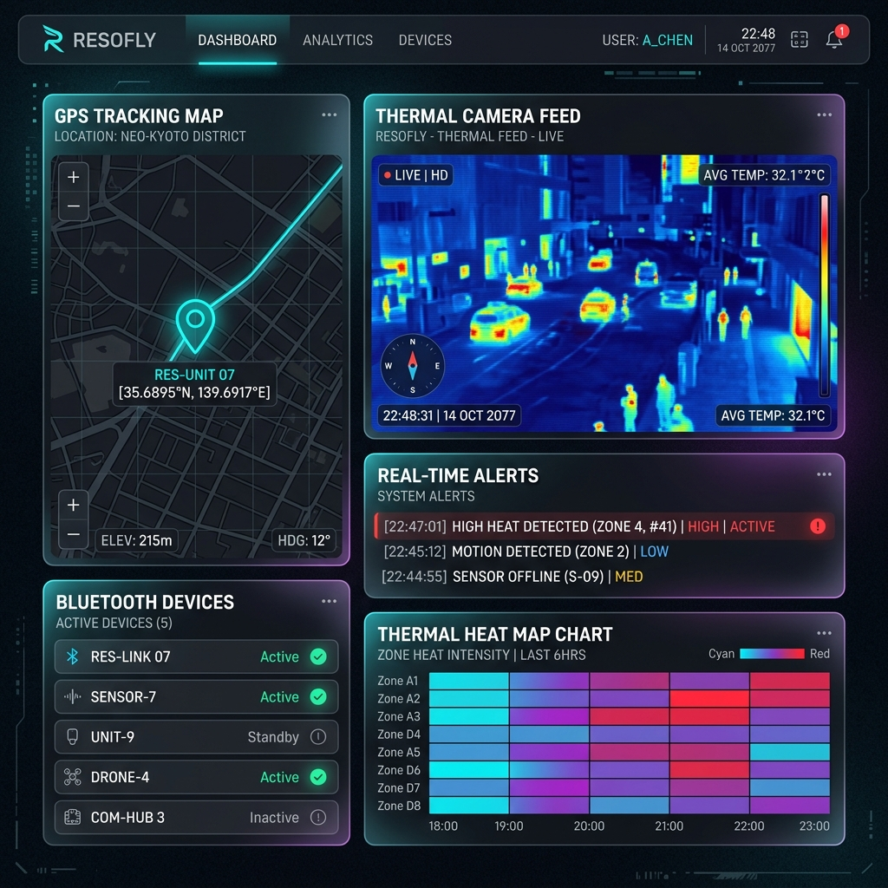

<p align="center">
  
</p>

<h1 align="center">RESOFLY</h1>

<p align="center">
  <b>🛸 Autonomous Thermal Vision Hub — Real-Time Aerial Surveillance on Raspberry Pi</b>
</p>

<p align="center">
  <i>Turn a $35 Raspberry Pi into a fully autonomous, remotely accessible thermal surveillance station.</i>
</p>

<p align="center">
  
  
  
  
  
</p>

<p align="center">
  <a href="https://github.com/bijoymg2023/RESOFLY/blob/main/LICENSE"></a>
  
  
  
  
</p>

<p align="center">
  <a href="#-what-is-resofly">About</a> •
  <a href="#-problem-it-solves">Problem</a> •
  <a href="#-who-is-this-for">Users</a> •
  <a href="#-features">Features</a> •
  <a href="#%EF%B8%8F-tech-stack">Tech Stack</a> •
  <a href="#%EF%B8%8F-architecture">Architecture</a> •
  <a href="#-installation">Install</a> •
  <a href="#-usage">Usage</a> •
  <a href="#%EF%B8%8F-screenshots--demo">Demo</a> •
  <a href="#-future-improvements">Roadmap</a> •
  <a href="#-contributing">Contribute</a> •
  <a href="#-license">License</a>
</p>

---

## 🧠 What is RESOFLY?

**RESOFLY** (**Re**mote **S**urveillance **O**perations — **Fly**) is a self-hosted, plug-and-play thermal surveillance system that transforms a **Raspberry Pi** into a fully autonomous monitoring station. It streams live thermal video from a **FLIR Lepton** sensor, tracks GPS coordinates in real-time, detects nearby Bluetooth devices, and delivers everything through a secure, beautifully designed **cyberpunk-themed web dashboard** — accessible from anywhere in the world via a Cloudflare tunnel.

> **Power on the Pi → Get an email with a public URL → Monitor everything from your browser.**  
> Zero manual configuration needed.

---

## 🎯 Problem It Solves

Traditional thermal surveillance setups require expensive hardware, complex networking, and manual supervision. RESOFLY eliminates all of that:

| Problem | RESOFLY Solution |
|---|---|
| 💰 **Expensive thermal systems** | Runs on a $35 Raspberry Pi with a low-cost FLIR Lepton sensor |
| 🌐 **Complex network setup** | Auto-tunnels to the internet via Cloudflare — zero port forwarding |
| 🔧 **Manual monitoring** | Fully autonomous: boot → tunnel → email notification |
| 🖥️ **Poor UI for embedded systems** | Premium glassmorphism dashboard with 3D drone login |
| 🔒 **No remote access** | Secure JWT-authenticated access from any browser, anywhere |
| 📡 **Limited situational awareness** | Combines thermal, GPS, and Bluetooth into a single unified hub |

---

## 👥 Who Is This For?

RESOFLY is designed for anyone who needs affordable, portable, and autonomous thermal surveillance:

| User | Use Case |
|---|---|
| 🔬 **Researchers & Academics** | Thermal imaging field studies & environmental monitoring |
| 🛡️ **Security Teams** | Perimeter surveillance, intrusion detection, and night patrol |
| 🧑‍💻 **IoT/Embedded Developers** | Reference architecture for Pi-based multi-sensor hubs |
| 🌿 **Wildlife Conservationists** | Night-time heat-signature monitoring & animal tracking |
| 🚒 **Emergency Responders** | Rapid-deploy thermal scanning for search & rescue |
| 🎓 **Students & Hobbyists** | Learning embedded systems, computer vision, and full-stack development |

---

## ✨ Features

### 🔥 Thermal Imaging
- Live MJPEG thermal video streaming (RGB / Thermal / Overlay modes)
- FLIR Lepton 3.5 integration with radiometric temperature data
- Real-time thermal heat map visualization with color mapping
- Human detection via centroid tracking algorithm

### 🛰️ GPS Tracking
- Real-time GPS coordinate display (latitude, longitude, altitude, speed)
- NMEA 0183 protocol parsing with `pynmea2`
- Interactive map integration with Leaflet.js
- One-click coordinate copy to clipboard

### 📡 Bluetooth Scanner
- Nearby Bluetooth device discovery and listing
- Signal strength (RSSI) monitoring
- Device count tracking with signal visualization

### 🔐 Security & Access
- JWT-based authentication with bcrypt password hashing
- Secure Cloudflare Tunnel — no port forwarding needed
- Automatic email notification with public access URL on boot
- Login-protected dashboard with session management

### 🎨 Premium UI/UX
- **Cyberpunk / Glassmorphism** design aesthetic
- Interactive 3D drone SVG on login screen (follows your cursor!)
- Dark/light theme toggle
- Fully responsive layout (desktop, tablet, mobile)
- Real-time alert system with ACK/dismiss functionality

### ⚡ Plug & Play Autonomy
- `systemd` services auto-start everything on boot
- Zero-config Cloudflare tunnel for instant remote access
- Gmail SMTP notification bot emails the access link automatically

---

## 🛠️ Tech Stack

### Frontend
| Technology | Purpose |
|---|---|
| **React 18** | Component-based UI framework |
| **TypeScript** | Type-safe development |
| **Vite** | Lightning-fast build tooling |
| **Tailwind CSS** | Utility-first styling |
| **Radix UI** | Accessible component primitives |
| **Leaflet.js** | Interactive GPS map rendering |
| **Recharts** | Real-time data visualization |
| **React Router** | SPA routing |

### Backend
| Technology | Purpose |
|---|---|
| **Python 3.9+** | Core runtime |
| **FastAPI** | High-performance async API server |
| **SQLite + aiosqlite** | Lightweight async database |
| **OpenCV** | Thermal image processing & color mapping |
| **PySerial + pynmea2** | GPS NMEA data parsing |
| **PyJWT + bcrypt** | Authentication & security |
| **Uvicorn** | ASGI server |

### Infrastructure
| Technology | Purpose |
|---|---|
| **Raspberry Pi 4** | Edge compute platform |
| **FLIR Lepton 3.5** | Thermal camera (I2C/SPI) |
| **U-blox GPS Module** | Location tracking (Serial/USB) |
| **Cloudflare Tunnel** | Secure remote access |
| **Docker** | Containerized deployment |
| **systemd** | Service lifecycle management |

---

## 🏗️ Architecture

```
┌─────────────────────────────────────────────────────────────┐
│                     RASPBERRY PI 4                          │
│                                                             │
│  ┌──────────────┐    ┌──────────────────────────────────┐   │
│  │  FLIR Lepton │───▶│        PYTHON BACKEND            │   │
│  │  (I2C/SPI)   │    │    ┌────────────────────┐        │   │
│  └──────────────┘    │    │   FastAPI Server    │        │   │
│                      │    │   (server.py)       │        │   │
│  ┌──────────────┐    │    ├────────────────────┤        │   │
│  │  GPS Module  │───▶│    │  Thermal Pipeline  │        │   │
│  │  (USB/UART)  │    │    │  Camera / GPS /    │        │   │
│  └──────────────┘    │    │  Bluetooth Modules │        │   │
│                      │    └────────┬───────────┘        │   │
│  ┌──────────────┐    │             │ REST + WebSocket    │   │
│  │  Bluetooth   │───▶│             ▼                    │   │
│  │  (HCI)       │    │    ┌────────────────────┐        │   │
│  └──────────────┘    │    │  SQLite Database   │        │   │
│                      │    └────────────────────┘        │   │
│                      └──────────────┬───────────────────┘   │
│                                     │                       │
│  ┌──────────────────────────────────▼───────────────────┐   │
│  │              REACT FRONTEND (Vite)                   │   │
│  │  Dashboard │ Video │ GPS Map │ Alerts │ BT Scanner   │   │
│  └──────────────────────────────────────────────────────┘   │
│                           │                                 │
│  ┌────────────────────────▼─────────────────────────────┐   │
│  │            CLOUDFLARE TUNNEL (cloudflared)            │   │
│  └──────────────────────────┬───────────────────────────┘   │
└─────────────────────────────┼───────────────────────────────┘
                              │
                    ┌─────────▼─────────┐
                    │   PUBLIC INTERNET  │
                    │  (Your Browser)   │
                    └───────────────────┘
```

---

## 📂 Project Structure

```
RESOFLY/
├── backend/
│   ├── server.py              # FastAPI main server (41KB)
│   ├── camera.py              # Simulated camera (dev mode)
│   ├── thermal_pipeline.py    # Thermal processing engine
│   ├── thermal_detection.py   # Human detection algorithms
│   ├── thermal_engine.py      # Thermal data engine
│   ├── waveshare_thermal.py   # Waveshare camera HAT support
│   ├── centroid_tracker.py    # Object centroid tracking
│   ├── gps_real.py            # GPS NMEA parser
│   ├── bluetooth_scanner.py   # BT device discovery
│   ├── monitor_tunnel.py      # Email notification bot
│   ├── setup_boot.sh          # systemd service installer
│   ├── start_backend.sh       # Backend startup script
│   ├── scan_helper.sh         # BT scan helper
│   ├── verify_sensors.py      # Hardware verification
│   ├── clear_alerts.py        # Alert database cleanup
│   └── requirements.txt       # Python dependencies
├── src/
│   ├── pages/
│   │   ├── Login.tsx           # 3D cyberpunk login screen
│   │   └── Index.tsx           # Dashboard entry point
│   ├── components/
│   │   ├── ThermalDashboard.tsx    # Main control center
│   │   ├── VideoStreamBox.tsx      # MJPEG stream viewer
│   │   ├── GPSCoordinateBox.tsx    # GPS display + map
│   │   ├── AlertBox.tsx            # Alert notifications
│   │   ├── ThermalHeatMap.tsx      # Heat map chart
│   │   ├── BluetoothScannerBox.tsx # BT device list
│   │   ├── IncidentMap.tsx         # Incident mapping
│   │   ├── SignalTracker.tsx       # Signal visualization
│   │   └── ThemeToggle.tsx         # Dark/light toggle
│   └── contexts/                   # Auth context
├── Dockerfile                 # Multi-stage Docker build
├── vite.config.ts             # Vite + API proxy config
├── tailwind.config.ts         # Tailwind theme config
├── package.json               # Frontend dependencies
├── LICENSE                    # MIT License
└── README.md                  # You are here!
```

---

## 🚀 Installation

### Prerequisites

| Requirement | Version |
|---|---|
| **Node.js** | ≥ 18 |
| **npm** | ≥ 9 |
| **Python** | ≥ 3.9 |
| **Git** | Latest |
| *(Production)* **Raspberry Pi 4** | With FLIR Lepton + GPS module |

### Step 1 — Clone the Repository

```bash
git clone https://github.com/bijoymg2023/RESOFLY.git
cd RESOFLY
```

### Step 2 — Setup Backend

```bash
# Create a Python virtual environment
python3 -m venv .venv
source .venv/bin/activate          # macOS / Linux
# .venv\Scripts\activate           # Windows

# Install Python dependencies
pip install -r backend/requirements.txt
```

### Step 3 — Setup Frontend

```bash
# Install Node.js dependencies
npm install
```

### Step 4 — Configure Environment

Create a `backend/.env` file with the following variables:

```env
SECRET_KEY=your-secret-key-here
ALGORITHM=HS256
ACCESS_TOKEN_EXPIRE=30
DATABASE_URL=sqlite:///./thermo_vision.db
```

> **💡 Tip:** Generate a strong secret key with `python3 -c "import secrets; print(secrets.token_hex(32))"`

### Step 5 — Run the Development Server

Open **two terminals** and run:

```bash
# Terminal 1 — Start the Backend (FastAPI)
source .venv/bin/activate
uvicorn backend.server:app --reload --host 0.0.0.0 --port 8000
```

```bash
# Terminal 2 — Start the Frontend (Vite)
npm run dev
```

✅ You should now be able to access the app:

| Service | URL |
|---|---|
| **Frontend (Dashboard)** | `http://localhost:5173` |
| **Backend API** | `http://localhost:8000/api` |
| **API Docs (Swagger)** | `http://localhost:8000/docs` |

### 🐳 Docker (Alternative)

```bash
docker build -t resofly .
docker run -p 8000:8000 resofly
```

---

## 💻 Usage

### Quick Start — Access the Dashboard

1. **Open your browser** and navigate to `http://localhost:5173`

2. **Login** with the default credentials:
   ```
   Username: admin
   Password: resofly123
   ```

3. **Explore the dashboard** — you'll have access to:

   | Panel | Description |
   |---|---|
   | 🔥 **Thermal Video Feed** | Live MJPEG stream — switch between RGB, Thermal, and Overlay modes |
   | 🛰️ **GPS Tracking** | Real-time coordinates displayed on an interactive Leaflet map |
   | 📊 **Thermal Heat Map** | Live temperature data visualization with color gradients |
   | ⚠️ **Alert System** | Auto-generated alerts for thermal anomalies with ACK/dismiss |
   | 📡 **Bluetooth Scanner** | Nearby device detection with signal strength tracking |

### Example — Raspberry Pi Production Deployment

```bash
# SSH into your Raspberry Pi
ssh pi@raspberrypi.local

# Clone and setup
git clone https://github.com/bijoymg2023/RESOFLY.git
cd RESOFLY
pip install -r backend/requirements.txt
npm install && npm run build

# Install auto-start services
cd backend
sudo bash setup_boot.sh
```

After running `setup_boot.sh`, three systemd services are configured:

```
✅ resofly.service         →  Python backend + thermal pipeline
✅ resofly-tunnel.service  →  Cloudflare tunnel for remote access
✅ resofly-notify.service  →  Email notification bot (sends you the URL)
```

Now simply **power on the Pi** and it will:
1. 🚀 Start all services automatically
2. 🌐 Create a Cloudflare tunnel to the public internet
3. 📧 Email you the public access URL

### API Reference

| Method | Endpoint | Description |
|---|---|---|
| `POST` | `/api/token` | Authenticate and receive JWT token |
| `GET` | `/api/gps` | Get current GPS coordinates |
| `GET` | `/api/system/status` | System health, CPU temp, uptime |
| `GET` | `/api/alerts` | List active thermal alerts |
| `GET` | `/api/stream/thermal` | MJPEG thermal video stream |
| `GET` | `/api/bluetooth/devices` | List discovered Bluetooth devices |

**Example — Fetch GPS data via cURL:**
```bash
# Authenticate
TOKEN=$(curl -s -X POST http://localhost:8000/api/token \
  -H "Content-Type: application/x-www-form-urlencoded" \
  -d "username=admin&password=resofly123" | jq -r '.access_token')

# Get GPS coordinates
curl -H "Authorization: Bearer $TOKEN" http://localhost:8000/api/gps
```

**Response:**
```json
{
  "latitude": 10.0261,
  "longitude": 76.3125,
  "altitude": 12.5,
  "speed": 0.0,
  "satellites": 8,
  "fix_quality": 1,
  "timestamp": "2026-04-10T12:30:00Z"
}
```

---

## 🖼️ Screenshots & Demo

<p align="center">
  <b>🔐 Login Page — Interactive 3D Drone</b><br/>
  <i>The drone SVG follows your cursor in real-time</i>
</p>

<p align="center">
  
</p>

<p align="center">
  <b>📊 Dashboard — Command Center</b><br/>
  <i>Thermal feed, GPS map, alerts, Bluetooth scanner — all in one view</i>
</p>

<p align="center">
  
</p>

> **🎥 Live Demo:** Deploy your own instance in under 5 minutes by following the [Installation](#-installation) guide!

---

## 🔮 Future Improvements

| Priority | Feature | Description |
|---|---|---|
| 🔴 High | **AI-Powered Detection** | Integrate YOLOv8 for person/animal/vehicle detection on thermal feeds |
| 🔴 High | **Multi-Camera Support** | Dashboard to manage and switch between multiple thermal cameras |
| 🟡 Medium | **Historical Playback** | Record and replay thermal footage with GPS trail overlay |
| 🟡 Medium | **Mobile App** | React Native companion app with push notifications |
| 🟡 Medium | **Edge ML Inference** | On-device TensorFlow Lite for real-time classification |
| 🟢 Future | **LoRa Mesh Networking** | Multi-Pi sensor grid with LoRa communication |
| 🟢 Future | **3D Terrain Mapping** | Fuse thermal + GPS data into 3D heatmap terrain models |
| 🟢 Future | **Battery Monitoring** | UPS HAT integration with battery level alerts |
| 🟢 Future | **Voice Alerts** | Text-to-speech announcements for critical thermal events |
| 🟢 Future | **Drone Integration** | MAVLink protocol for autonomous drone flight control |

---

## 🤝 Contributing

We welcome contributions from the community! Whether it's a bug fix, new feature, or documentation improvement — every contribution counts.

### How to Contribute

1. **Fork** the repository
2. **Create** your feature branch:
   ```bash
   git checkout -b feature/amazing-feature
   ```
3. **Commit** your changes using [Conventional Commits](https://www.conventionalcommits.org/):
   ```bash
   git commit -m "feat: add amazing feature"
   ```
4. **Push** to your branch:
   ```bash
   git push origin feature/amazing-feature
   ```
5. **Open** a Pull Request

### Contribution Ideas

- 🐛 Bug reports and fixes
- 📝 Documentation improvements
- 🎨 UI/UX enhancements
- 🧪 Unit and integration tests
- 🌍 Internationalization (i18n) support
- ♿ Accessibility improvements

---

## 📄 License

This project is **open source** and available under the **[MIT License](LICENSE)**.

```
MIT License — Copyright (c) 2026 Bijoy Mathew George

You are free to use, modify, and distribute this software
for both personal and commercial purposes.
```

See the [LICENSE](LICENSE) file for full details.

---

## 🙏 Acknowledgments

- **[FLIR Systems](https://www.flir.com/)** — FLIR Lepton thermal sensor documentation
- **[Cloudflare](https://www.cloudflare.com/)** — Free tunnel service for remote access
- **[Raspberry Pi Foundation](https://www.raspberrypi.org/)** — The amazing single-board computer
- **[FastAPI](https://fastapi.tiangolo.com/)** — High-performance Python web framework
- **[React](https://react.dev/)** — Frontend UI library
- **[Leaflet](https://leafletjs.com/)** — Interactive map library

---

<p align="center">
  <b>Built with 🔥 on Raspberry Pi</b><br/>
  <sub>RESOFLY — See the unseen.</sub>
</p>

<p align="center">
  <a href="https://github.com/bijoymg2023/RESOFLY/stargazers">⭐ Star this repo</a> if you find it useful!
</p>
